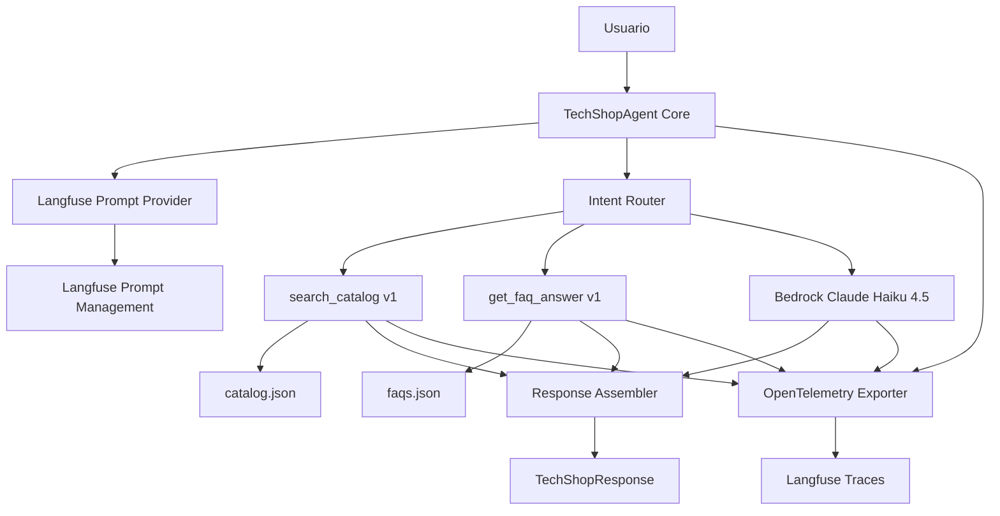

# Diseño técnico: TechShop Agent con tools básicas

## Resumen
Este diseño alinea el agente base con el MVP actualizado: consultas de catálogo y políticas de tienda mediante tools v1 con keyword matching deliberadamente limitado, respuesta estructurada y trazabilidad completa vía OpenTelemetry hacia Langfuse.
El diseño incluye gestión de system prompt en Langfuse Prompt Management con fallback local seguro y manejo controlado de fallos de tools/LLM.
No incluye guardrails de entrada/salida en esta fase (se implementan en Día 2), ni estado de pedidos, ni integraciones transaccionales.

## Objetivos y no-objetivos
### Objetivos
- Cubrir los requisitos MVP 1, 2, 3, 4, 5, 6 y 7 de `requirements.md`.
- Mantener contrato de salida estable: `answer`, `confidence`, `category`, `requires_human`.
- Diseñar componentes desacoplados para evolucionar tools v1 a v2 (embeddings + FAISS) sin romper firmas.

### No-objetivos
- Implementar consulta de estado de pedidos, pagos o devoluciones transaccionales.
- Implementar guardrails de input/output en el agente base.
- Implementar memoria conversacional persistente o ticketing automático.

## Arquitectura propuesta y alternativas descartadas

### Patrón seleccionado
**Patrón:** Orquestador con router de intención + tools especializadas + ensamblador de respuesta + capa de observabilidad.

**Rationale:**
- Encaja con la estructura existente (`process_query` y registro de tools).
- Permite aplicar fallback seguro por dependencia sin romper el contrato de salida.
- Hace explícita la telemetría por spans (agent/cycle/llm/tool) exigida por el MVP.

### Alternativas descartadas
| Opción | Motivo de descarte |
|---|---|
| Agente monolítico sin separación de tools | Dificulta aislar fallos deliberados y medirlos en trazas/evals. |
| Clasificador semántico complejo en MVP | Reduce valor didáctico de fallos observables de keyword matching v1. |
| Prompt hardcoded único | Impide iteración por alumnos sin tocar código y rompe objetivo de Prompt Management. |

## Componentes e interfaces (contratos)

### Mapa de componentes
| Componente | Dominio | Intención | Requisitos |
|---|---|---|---|
| TechShopAgentCore | Orquestación | Coordinar pipeline de consulta | 1, 4, 5, 6, 7 |
| AgentConfig (Pydantic) | Configuración | Validar y tipar configuración crítica del agente | 4, 5 |
| IntentRouter | Orquestación | Decidir ruta (`product`, `faq`, `mixed`, `general`, `out_of_scope`) | 1, 7 |
| CatalogToolV1 | Integración | Buscar productos por keyword matching | 1, 2, 6 |
| FaqToolV1 | Integración | Buscar políticas por keyword matching | 1, 3, 6 |
| PromptProvider | Configuración | Obtener prompt desde Langfuse + fallback local | 5 |
| ResponseAssembler | Dominio respuesta | Construir `TechShopResponse` consistente | 1, 6, 7 |
| ObservabilityTracer | Observabilidad | Registrar spans y errores OTEL | 4, 6 |

### Contratos de servicio

#### 1) TechShopAgentCoreService
- **Responsabilidad:** Ejecutar flujo `consulta -> routing -> tools/LLM -> respuesta estructurada`.
- **Entrada:** `user_query: str`, `user_id: str | None`, `context: dict | None`.
- **Salida:** `TechShopResponse`.
- **Postcondición:** siempre retorna estructura completa; excepciones se traducen a fallback controlado.

**Firma contractual (diseño):**
- `process_query(user_query: str, user_id: str | None = None, context: dict | None = None) -> TechShopResponse`

#### 1.1) AgentConfigModel
- **Responsabilidad:** modelar y validar configuración del agente con Pydantic (`BaseModel`).
- **Campos críticos:** credenciales Langfuse, endpoint/headers OTEL, nombre/label de prompt, parámetros Bedrock.
- **Garantía:** la inicialización falla temprano con errores claros si falta configuración obligatoria.

#### 2) IntentRouterService
- **Responsabilidad:** Clasificar intención de consulta y decidir tools a invocar.
- **Salida:** `IntentDecision(intent, tools_to_call, confidence)`.
- **Reglas mínimas:**
  - Consulta de producto/recomendación -> invocar `search_catalog`.
  - Consulta de políticas (devoluciones, envíos, garantías, pagos, horarios) -> invocar `get_faq_answer`.
  - Consulta mixta (producto + políticas) -> invocar ambas tools en el mismo turno.
  - Consulta fuera del dominio tienda -> `category="out_of_scope"`, `requires_human=true`, sin invocar tools.
  - Consulta ambigua dentro del dominio sin evidencia suficiente -> `category="general"` sin tools.

#### 3) CatalogToolV1Service
- **Responsabilidad:** Ejecutar búsqueda v1 sobre `catalog.json`.
- **Firma:** `search_catalog(query: str) -> str`.
- **Comportamiento v1 (deliberado):**
  - Matching por `query.lower() in (name + " " + description).lower()`.
  - Sin stemming, sin fuzzy, sin ranking.
  - Si no hay resultados: mensaje explícito `no se encontraron productos para: {query}`.

#### 4) FaqToolV1Service
- **Responsabilidad:** Ejecutar búsqueda v1 sobre `faqs.json`.
- **Firma:** `get_faq_answer(question: str) -> str`.
- **Comportamiento v1 (deliberado):**
  - Matching por palabras de `question.lower()` (excluyendo stopwords básicas) contra `(faq.question + " " + faq.answer).lower()`.
  - Si hay múltiples coincidencias: devolver primera coincidencia.
  - Si no hay resultados: mensaje explícito `no se encontró información sobre: {question}`.

#### 5) PromptProviderService
- **Responsabilidad:** Obtener system prompt desde Langfuse Prompt Management por `prompt_name` y `label`.
- **Variables soportadas:** `{{catalog_categories}}`, `{{faq_topics}}`.
- **Fallback:** si Langfuse no está disponible, usar prompt hardcoded funcional y registrar warning.

#### 6) ObservabilityTracerService
- **Responsabilidad:** Emitir trazas OTEL consumibles por Langfuse.
- **Spans requeridos por consulta:** `agent`, `cycle`, `llm`, `tool`.
- **Datos mínimos por tool span:** nombre, parámetros, resultado, duración.
- **Atributos de traza:** incluir `user_id` cuando exista.

## Modelo de datos y validaciones

### Modelo de dominio lógico
| Entidad/VO | Campos | Validaciones |
|---|---|---|
| IntentDecision | `intent`, `tools_to_call`, `confidence` | `intent` en {`product`, `faq`, `mixed`, `general`, `out_of_scope`} |
| CatalogResult | `items`, `raw_message` | `items=[]` cuando no hay match |
| FaqResult | `match`, `raw_message` | `match=None` cuando no hay match |
| TechShopResponse | `answer`, `confidence`, `category`, `requires_human` | siempre presente y parseable |

### Reglas de validación
- **Entrada:** texto plano no vacío; normalización básica de espacios.
- **Salida:** serialización obligatoria al contrato `TechShopResponse`.
- **Configuración:** validación declarativa en `AgentConfig` (Pydantic) para credenciales y parámetros obligatorios.
- **Invariante global:** no inventar productos fuera de `catalog.json` cuando se responda en categoría `product`.
- **Regla de consistencia:** si `confidence="low"` entonces `requires_human=true`.

### Tooling de entorno y ejecución
- La gestión de entorno/dependencias y ejecución local de comandos se estandariza con `uv`.
- El empaquetado del proyecto se estandariza con backend `hatchling` en `pyproject.toml`.
- El flujo local usa instalación editable del paquete (`uv pip install -e .`) para evitar configuración manual de `PYTHONPATH`.
- Comandos de validación y test de la spec deben ejecutarse con `uv run ...` para evitar desalineación entre entornos de alumnos.

## Manejo de errores y observabilidad

### Estrategia de errores
- **Degradación controlada:** ante fallo de `search_catalog`, `get_faq_answer` o LLM, devolver mensaje de limitación con `confidence="low"` y `requires_human=true`.
- **No propagación de excepciones:** la salida pública siempre respeta `TechShopResponse`.
- **Registro de error en traza:** tipo de error y contexto operativo.

### Matriz de respuesta por categoría de error
| Categoría | Ejemplo | Respuesta al usuario | Efecto en contrato |
|---|---|---|---|
| Falla `search_catalog` | timeout o excepción | limitación temporal de información de productos | `confidence=low`, `requires_human=true`, `category=product` |
| Falla `get_faq_answer` | timeout o excepción | indisponibilidad temporal de políticas | `confidence=low`, `requires_human=true`, `category=faq` |
| Falla LLM/Bedrock | timeout o error de servicio | mensaje genérico controlado | `confidence=low`, `requires_human=true` |
| Prompt Langfuse no disponible | error red/autenticación | usar fallback prompt y continuar | warning en logs + traza |

### Observabilidad
- Exportación OTEL mediante `OTEL_EXPORTER_OTLP_ENDPOINT` y `OTEL_EXPORTER_OTLP_HEADERS`.
- Trazas con estructura jerárquica: `agent span` -> `cycle spans` -> `llm/tool spans`.
- Métricas mínimas:
  - tasa de `requires_human=true`,
  - tasa de errores por tool,
  - latencia p50/p95 end-to-end,
  - porcentaje de consultas `out_of_scope`.

## Impacto en seguridad, rendimiento y coste

### Seguridad
- MVP sin guardrails de entrada/salida por decisión didáctica explícita.
- El riesgo de alucinación se mitiga parcialmente vía prompt y evaluación posterior (golden dataset).

### Rendimiento
- Objetivo nominal: completar respuesta en <= 15 segundos.
- Presupuesto sugerido de latencia:
  - routing + tool(s): <= 4 s,
  - LLM: <= 8 s,
  - ensamblado + serialización: <= 1 s,
  - margen operativo: <= 2 s.

### Coste
- Modelo único para MVP: Claude Haiku 4.5 con `max_tokens=1024`.
- Tools locales sobre JSON minimizan coste variable.
- La observabilidad añade coste por volumen de trazas; se controla con etiquetado por alumno (`user_id`).

## Estrategia de testing vinculada a requisitos

### Matriz de trazabilidad requisitos -> pruebas
| ID | Cobertura de diseño | Pruebas propuestas |
|---|---|---|
| 1.1 | Router + CatalogToolV1 | Integración: consulta de producto invoca `search_catalog` |
| 1.2 | Router + FaqToolV1 | Integración: consulta de políticas invoca `get_faq_answer` |
| 1.3 | Router + Core | Integración: consulta mixta invoca ambas tools en un turno |
| 1.4 | Router + Assembler | Unit: fuera de ámbito retorna `out_of_scope` sin tools |
| 1.5 | ResponseAssembler | Unit: siempre retorna los 4 campos del contrato |
| 2.1 | CatalogToolV1 | Unit: match exacto devuelve nombre/precio/stock/descripción |
| 2.2 | CatalogToolV1 | Unit: sinónimo no presente devuelve 0 resultados (fallo deliberado) |
| 2.3 | CatalogToolV1 | Unit: múltiples matches se devuelven sin ranking/límite |
| 2.4 | CatalogToolV1 | Unit: mensaje explícito cuando no hay resultados |
| 2.5 | CatalogToolV1 | Unit: validación de algoritmo puro `lower()+in` |
| 3.1 | FaqToolV1 | Unit: vocabulario presente devuelve FAQ correspondiente |
| 3.2 | FaqToolV1 | Unit: sinónimo ausente devuelve 0 resultados (fallo deliberado) |
| 3.3 | FaqToolV1 | Unit: múltiples matches devuelven primera coincidencia |
| 3.4 | FaqToolV1 | Unit: mensaje explícito cuando no hay FAQ |
| 3.5 | FaqToolV1 | Unit: matching por palabras sin stopwords básicas |
| 4.1-4.4 | ObservabilityTracer | Integración: presencia de spans agent/cycle/llm/tool y atributos requeridos |
| 5.1-5.4 | PromptProvider | Integración: carga por label, fallback y refresh sin redeploy |
| 6.1-6.5 | Error handling + tracer | Integración: fallos de tools/LLM devuelven fallback y quedan trazados |
| 7.1-7.6 | ResponseAssembler + datos JSON | Unit/Integración: contrato, categorías y no alucinación verificables |

### Capas de prueba
- **Unitarias:** router, tools v1, ensamblador de respuesta, proveedor de prompt.
- **Integración:** flujo `process_query` con mocks de Bedrock/Langfuse y JSON real local.
- **No funcionales:** latencia end-to-end bajo condiciones nominales para validar objetivo de 15 s.

## Cobertura y requisitos no cubiertos por este diseño
- **Requisito 8 [FUTURO]:** tools v2 con embeddings + FAISS no se implementan en MVP; se deja contrato de tools estable para migración.
- **Guardrails Día 2:** fuera de alcance por decisión de programa formativo, aunque se preserva punto de extensión.
- **Umbral exacto de confianza:** no se fija en este diseño; se deja como ejercicio de guardrails/evaluación.

## Decisiones de alcance explícitas
- No se añaden features fuera de requisitos (pedidos, CRM, ticketing, memoria persistente, UI).
- Se mantienen fallos deliberados de keyword matching para aprendizaje observable en Langfuse.
- Se preserva el contrato `TechShopResponse` como interfaz estable para evals y validaciones Pydantic.
