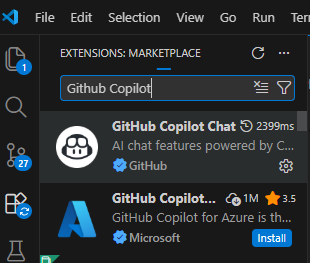
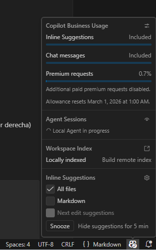

# GitHub Copilot + Spec-Driven Development
### Guía de onboarding para desarrolladores

Esta guía está pensada para ayudarte a incorporar IA en tu flujo de trabajo sin perder control técnico. La idea no es usar más herramientas por usar, sino tomar mejores decisiones de ingeniería con un proceso claro, verificable y fácil de compartir en equipo.

## 0. Cómo usar esta guía (si empiezas desde cero)

Si nunca has trabajado con GitHub Copilot, desarrollo con IA o SDD, usa esta secuencia:

1. Lee **secciones 1 y 2** para dejar tu entorno funcionando.
2. Lee **sección 3** para asentar conceptos operativos clave.
3. Lee **secciones 4 y 5** para entender el enfoque SDD.
4. Ejecuta **sección 6** (flujo manual) en una feature pequeña.
5. Continúa con **sección 7** (`cc-sdd`) y **sección 8** (alternativas).
6. Pasa por **sección 9** para añadir un firewall de calidad.
7. Cierra con **secciones 10 y 11** para ampliar Copilot con MCP y Hooks.

### Resultado esperado al terminar el onboarding

- Tener Copilot operativo en VS Code.
- Saber diferenciar vibe coding y flujo SDD.
- Poder generar `requirements.md`, `design.md` y `tasks.md` para una feature.
- Tener una base de validación automática con `pre-commit`.
- Entender cómo ampliar y controlar agentes con MCP y Hooks.

---

## 1. Qué es GitHub Copilot

GitHub Copilot es un **asistente de desarrollo con IA** integrado directamente en tu editor. No es un buscador de documentación ni un chatbot genérico: tiene acceso a tu codebase, entiende el contexto de lo que estás construyendo y puede actuar de forma autónoma para completar tareas complejas.

Dependiendo de cómo lo uses, Copilot puede:

- Sugerir código mientras escribes (autocompletado)
- Responder preguntas sobre tu proyecto en lenguaje natural
- Ejecutar cambios en múltiples ficheros de forma autónoma
- Investigar el codebase, proponer soluciones y generar test
- Crear planes de implementación para realizar tareas más complejas.

### Límites y control (importante)

Aunque Copilot ayude mucho, **no sustituye tu responsabilidad técnica**:

- Tú validas requisitos, diseño y decisiones de arquitectura.
- Tú revisas cambios antes de aceptar ediciones masivas.
- Tú ejecutas y validas tests/checks de calidad.
- Tú verificas seguridad, cumplimiento y manejo de secretos.

> **Licencia:** Hiberus proporciona la licencia. Haz la petición a tu manager para que se te asigne una licencia desde sistemas.

### Recursos oficiales y de referencia

- [GitHub Docs (Copilot)](https://docs.github.com/en/copilot)
- [Qué es Copilot (GitHub Docs)](https://docs.github.com/en/copilot/get-started/what-is-github-copilot)
- [Copilot en VS Code (documentación oficial)](https://code.visualstudio.com/docs/copilot/overview)
- [Trust Center FAQ (seguridad, privacidad y cumplimiento)](https://copilot.github.trust.page/faq)

---

## 2. Instalación y configuración inicial

### Prerrequisitos

- Última versión disponible de **VS Code**. El equipo de VS Code lanza actualizaciones frecuentes que habilitan nuevos modelos y mejoras de interacción con Copilot y sus agentes. Descarga [VS Code aquí](https://code.visualstudio.com/).
- **Extensión GitHub Copilot**. Se integra con el IDE para ofrecernos su funcionalidad. Instálala desde el [Marketplace oficial](https://marketplace.visualstudio.com/items?itemName=GitHub.copilot) o búscala en la tienda de extensiones de VS Code.

    
- **Cuenta GitHub** con licencia Copilot activa (gestionada por Hiberus)


### Autenticación

1. Abre VSCode → `Ctrl+Shift+P` → `GitHub Copilot: Sign In`
2. Sigue el flujo OAuth con tu cuenta GitHub corporativa
3. Verifica que aparece el icono de Copilot en la barra de estado (esquina inferior derecha)

    
### Settings recomendados

Antes de pegar la configuración, abre el fichero correcto en VS Code:

- **Settings de usuario** (aplican a todos tus proyectos): `Ctrl+Shift+P` → `Preferences: Open User Settings (JSON)`.
- **Settings del workspace** (solo este repositorio): `Ctrl+Shift+P` → `Preferences: Open Workspace Settings (JSON)`.

Para onboarding, suele ser suficiente usar settings de usuario. Si el equipo quiere estandarizar comportamiento en este repo, usa el settings de workspace (`.vscode/settings.json`).

Añade esto a tu `settings.json`:

```json
{
  "chat.agent.enabled": true,
  "chat.viewSessions.enabled": true,
  "github.copilot.chat.agent.thinkingTool": true
}
```

### Por qué recomendamos esta configuración

- `chat.agent.enabled: true`: activa el modo Agent para que Copilot pueda ejecutar tareas más completas (investigar contexto, proponer cambios y aplicarlos en varios archivos) en lugar de limitarse a respuestas puntuales.
- `chat.viewSessions.enabled: true`: habilita sesiones de chat para separar contexto por fase (requisitos, diseño, tareas, implementación), lo que mejora trazabilidad y reduce deriva en conversaciones largas.
- `github.copilot.chat.agent.thinkingTool: true`: permite que el agente exponga mejor su razonamiento operativo y pasos intermedios, útil para revisión técnica y aprendizaje durante onboarding.

Documentación oficial relacionada:

- [Copilot Agent mode en VS Code](https://code.visualstudio.com/docs/copilot/chat/chat-agent-mode)
- [Copilot Chat sessions en VS Code](https://code.visualstudio.com/docs/copilot/chat/chat-sessions)
- Personalización y configuración ampliada: ver sección 5.

### Atajos esenciales

| Acción | Atajo |
|---|---|
| Abrir Copilot Chat | `Ctrl+Alt+I` |
| Chat en modo Agent | `Ctrl+Shift+I` |
| Inline chat (sobre selección) | `Ctrl+I` |

> Nota: los atajos pueden variar según sistema operativo, layout de teclado o personalizaciones de VS Code.

### Recursos oficiales y de referencia

- [Setup de Copilot en VS Code](https://code.visualstudio.com/docs/copilot/setup)
- [Quickstart de Copilot (GitHub Docs)](https://docs.github.com/en/copilot/get-started/quickstart)
- [Extensión oficial GitHub Copilot Chat (Marketplace)](https://marketplace.visualstudio.com/items?itemName=GitHub.copilot-chat)

---

## 3. Conceptos operativos para trabajar con agentes

Esta sección define el vocabulario base y un principio operativo que condiciona directamente cómo ejecutar SDD con agentes.

### Glosario mínimo

Usa este glosario como referencia rápida durante el resto de la guía.

| Término / Acrónimo | Tipo | Definición práctica |
|---|---|---|
| **Agent Mode** | Término | Modo de chat en el que Copilot puede investigar, proponer y aplicar cambios de forma más autónoma. |
| **SDD** (Spec-Driven Development) | Acrónimo | Enfoque en el que primero se especifica (qué/cómo/orden) y después se implementa. |
| **EARS** (Easy Approach to Requirements Syntax) | Acrónimo | Formato estructurado para redactar requisitos verificables y menos ambiguos. |
| **TDD** (Test-Driven Development) | Acrónimo | Desarrollo guiado por tests: primero prueba, luego implementación, luego refactor. |
| **MCP** (Model Context Protocol) | Acrónimo | Protocolo para conectar Copilot con herramientas y servicios externos (APIs, DBs, etc.). |
| **LGTM** (Looks Good To Me) | Acrónimo | Aprobación explícita tras revisión de un artefacto o cambio. |
| **PR** (Pull Request) | Acrónimo | Propuesta de cambios en Git para revisión antes de integrar en rama principal. |
| **Context Window** | Término | Cantidad de contexto que el modelo puede mantener activo por interacción. |
| **Trazabilidad** | Término | Relación explícita entre requisito → diseño → tarea → validación. |
| **Trade-off** | Término | Decisión técnica con beneficios y costes que deben quedar justificados. |
| **MVP** (Minimum Viable Product) | Acrónimo | Alcance mínimo con valor real para validar antes de ampliar funcionalidad. |
| **ADR** (Architecture Decision Record) | Acrónimo | Documento corto que registra una decisión de arquitectura y su razonamiento. |

### Principio operativo: gestión de Context Window en SDD

Con estos términos claros, el siguiente punto crítico es la gestión del contexto durante sesiones largas.

Aunque Copilot puede trabajar con mucho contexto, **no es infinito**. Si una sesión acumula demasiados mensajes, archivos o cambios mezclados, baja la precisión: el agente puede omitir detalles, repetir decisiones o perder trazabilidad.

Regla práctica para equipos:

- Mantén cada conversación con **un objetivo claro** (una fase o una tarea concreta).
- Divide trabajo grande en bloques pequeños: requisito → diseño → tareas → implementación.
- Reinyecta contexto crítico en cada fase (supuestos, alcance, criterio de done).
- Cuando notes deriva, abre sesión nueva y arranca con un resumen corto del estado actual.
- Guarda decisiones clave en artefactos versionados (`requirements.md`, `design.md`, `tasks.md`) en lugar de confiar en el historial del chat.

Este principio se aplica de forma directa en las secciones de flujo SDD (generación de `requirements.md`, `design.md` y `tasks.md` por fases separadas).

---

## 4. Vibe coding: productividad a coste de control

**Vibe coding** es el modo de trabajo en el que describes lo que quieres en lenguaje natural y delegas completamente la implementación al agente. Prompt → código. Sin planificación previa, sin revisión de arquitectura.

Para prototipos rápidos, exploración o funcionalidades aisladas funciona bien. El problema aparece cuando escalas:

- El agente toma decisiones de diseño implícitas que no has validado
- Sin requisitos claros, cada iteración puede contradecir la anterior
- El código generado resuelve *lo que pediste*, no necesariamente *lo que necesitas*
- Los tests, si existen, llegan al final y validan el código, no los requisitos

En proyectos con múltiples developers, el caos se amplifica: cada persona interactúa con el agente desde su propio contexto, sin una fuente de verdad compartida.

> El vibe coding no es malo. Es una herramienta. El problema es usarlo donde necesitas ingeniería.

### Regla simple para principiantes

- Usa vibe coding para **probar ideas rápidas**.
- Usa SDD para **trabajo de equipo, cambios persistentes o sistemas críticos**.

### Recursos oficiales y de referencia

- [Buenas prácticas de uso (GitHub Docs)](https://docs.github.com/en/copilot/get-started/best-practices)
- [Tips oficiales para usar Copilot en VS Code](https://code.visualstudio.com/docs/copilot/copilot-tips-and-tricks)
- Guía de personalización ampliada: ver sección 5.

---

## 5. Spec-Driven Development: estructura antes que código

**Spec-Driven Development (SDD)** añade una fase de especificación explícita antes de que el agente toque el código. El agente no implementa directamente — primero genera artefactos de planificación que el developer revisa y aprueba.

En esta guía, usamos un flujo SDD práctico en tres fases (requirements → design → tasks) para pasar de idea a implementación con control humano.

Tomamos como referencia la implementación de AWS Kiro porque resulta clara para onboarding (tres artefactos y tres puertas de revisión), fuerza trazabilidad entre fases y encaja bien con trabajo asistido por agentes en Copilot. Aun así, Kiro es **una** forma de implementar SDD, no la única: según producto, dominio o equipo, los artefactos y su granularidad pueden variar (por ejemplo, añadir discovery/research, ADRs, plan de validación o fusionar documentos).

El flujo tiene tres fases secuenciales con **human in the loop** entre cada una:

| Paso | Artefacto | Pregunta clave | Control humano |
|---|---|---|---|
| 1 | Idea / Feature request | ¿Qué queremos resolver? | Sí |
| 2 | `requirements.md` | ¿Qué debe hacer el sistema? | Revisión y aprobación |
| 3 | `design.md` | ¿Cómo lo vamos a construir? | Revisión y aprobación |
| 4 | `tasks.md` | ¿En qué orden se implementa? | Revisión y aprobación |
| 5 | Implementación | ¿Se ejecuta y valida tarea a tarea? | Sí |

Cada artefacto tiene un formato específico que fuerza precisión:

**`requirements.md`** usa notación EARS — un estándar ampliamente usado en ingeniería de requisitos para sistemas críticos:
```
WHEN [condición/evento] THE SYSTEM SHALL [comportamiento esperado]
IF [precondición] THE SYSTEM SHALL [respuesta del sistema]
```

**`design.md`** documenta arquitectura, modelos de datos, diagramas de secuencia y estrategia de testing antes de escribir una sola línea.

**`tasks.md`** traduce el diseño en pasos atómicos ordenados para TDD — cada tarea está escrita como un prompt listo para el agente de codificación.

### Checklist rápido de calidad por artefacto

- `requirements.md`: requisitos verificables, alcance/no alcance y supuestos claros.
- `design.md`: decisiones técnicas justificadas, riesgos y estrategia de testing.
- `tasks.md`: tareas pequeñas, ordenadas y con criterio de “done” comprobable.

### Qué ganas con SDD

- **Control real sobre lo que se construye**: revisas los requisitos antes de que el agente diseñe, y el diseño antes de que implemente
- **Coherencia entre fases**: el diseño referencia los requisitos, las tareas referencian el diseño
- **Documentación como artefacto de producción**: los ficheros `.md` se versiona en Git junto al código
- **Onboarding más rápido**: un nuevo developer entiende qué hace una feature y por qué leyendo la spec, sin necesidad de arqueología de código

### Cómo orientar el comportamiento de los agentes en Copilot

En Copilot, puedes orientar el comportamiento de los agentes combinando tres capas: **instrucciones persistentes + instrucciones por ámbito + prompts reutilizables**.

Cómo se traduce en la práctica:

- **Reglas globales (always-on)** → `AGENTS.md` o `.github/copilot-instructions.md`.
- **Reglas por contexto** (lenguaje, carpeta o tipo de archivo) → `.github/instructions/*.instructions.md` con frontmatter `applyTo`.
- **Flujos operativos repetibles** (slash commands) → `.github/prompts/*.prompt.md`.

Qué puedes modificar con estas capas:

- Estilo y convenciones de código/documentación.
- Reglas de arquitectura y decisiones preferidas.
- Checklist de validación (tests, lint, type-check, seguridad).
- Forma de planificar y ejecutar tareas en Agent Mode.

Las referencias oficiales de esta sección están agrupadas en el bloque de recursos de abajo.

Estado actual en este repositorio:

- Ya hay instrucciones persistentes activas vía `AGENTS.md`.
- Ya existen prompts reutilizables en `.github/prompts/`.
- Aún no hay `.github/copilot-instructions.md` ni reglas por ámbito en `.github/instructions/`.

Estructura mínima recomendada (3 archivos):

- **Global**: `.github/copilot-instructions.md`
- **Python**: `.github/instructions/python.instructions.md` con `applyTo: "**/*.py"`
- **Docs**: `.github/instructions/docs.instructions.md` con `applyTo: "docs/**/*.md"`

### Qué es `applyTo` (y cómo funciona en la práctica)

`applyTo` es el campo de frontmatter que define **a qué archivos aplica** una instrucción en `.github/instructions/*.instructions.md`.

Cómo interpretarlo:

- Si el archivo que estás editando **coincide** con el patrón, la instrucción se carga.
- Si **no coincide**, la instrucción se ignora para ese archivo.
- El patrón se expresa como glob (no regex), por ejemplo `"**/*.py"` o `"docs/**/*.md"`.

Ejemplo mínimo:

```yaml
---
applyTo: "**/*.py"
---

Usa typing estricto, pytest y docstrings estilo Google.
```

Buenas prácticas:

- Empieza con alcance estrecho (`"docs/**/*.md"`, `"src/**/*.py"`) y amplía solo si hace falta.
- Evita patrones demasiado amplios cuando la regla es específica de un contexto.
- Mantén una intención clara por archivo de instrucciones (Python, docs, tests, etc.).

### Recursos oficiales y de referencia

- [Customize AI in VS Code (overview)](https://code.visualstudio.com/docs/copilot/customization/overview)
- [Custom instructions en VS Code](https://code.visualstudio.com/docs/copilot/customization/custom-instructions)
- [Prompt files en VS Code](https://code.visualstudio.com/docs/copilot/customization/prompt-files)
- [Repository custom instructions en GitHub Docs](https://docs.github.com/en/copilot/how-tos/configure-custom-instructions/add-repository-instructions)

---

## 6. SDD con Copilot Agents en modo plan (sin herramientas externas)

Puedes aplicar el enfoque SDD directamente con **Copilot Chat en modo Agent** pidiéndole explícitamente trabajar en **modo plan** antes de escribir código.

La clave es mantener las mismas 3 fases y el mismo punto de control humano entre fases (o la variación que hayas elegido).

Convención de rutas en esta guía:

- **Flujo manual con Copilot**: usa `.ai/specs/{feature}/...`
- **Flujo automatizado con `cc-sdd`**: usa `.kiro/specs/{feature}/...`

### Flujo recomendado (manual)

1. Crea una carpeta para la feature, por ejemplo:
  - `.ai/specs/{nombre-feature}/`
2. Genera `requirements.md` con Copilot en modo plan.
3. Revisa y aprueba manualmente.
4. Genera `design.md` referenciando `requirements.md`.
5. Revisa y aprueba manualmente.
6. Genera `tasks.md` referenciando `design.md` y `requirements.md`.
7. Ejecuta tareas una a una en Agent Mode, validando tests en cada paso.

### Señales de que vas bien

- Al final de la fase 1 tienes `requirements.md` sin código implementado.
- Al final de la fase 2 tienes `design.md` referenciando requisitos.
- Al final de la fase 3 tienes `tasks.md` con orden de ejecución y validación.
- Solo después empiezas a implementar.

### Prompts base por fase

#### Prompt para requisitos

```text
Actúa en modo plan. No escribas código.
Genera .ai/specs/{feature}/requirements.md para la feature "{feature}".
Usa formato EARS con criterios de aceptación verificables.
Incluye: alcance, no-alcance, supuestos, riesgos y dependencias.
```

Ejemplo más guiado (incluyendo límites explícitos):

```text
Actúa en modo plan. No escribas código.
Genera .ai/specs/{feature}/requirements.md para la feature "{feature}".

Estructura obligatoria:
1) Objetivo de negocio (3-5 líneas)
2) Alcance (in-scope) en bullets concretos
3) No-alcance (out-of-scope) en bullets concretos
4) Supuestos (funcionales/técnicos)
5) Riesgos y mitigaciones
6) Dependencias externas
7) Requisitos EARS + criterios de aceptación verificables

Reglas:
- Marca con [MVP] lo imprescindible y con [FUTURO] lo diferible.
- Evita ambigüedad; usa lenguaje testable.
- Si falta contexto, añade una sección "Preguntas abiertas".
```

#### Prompt para diseño

```text
Actúa en modo plan. No escribas código.
Lee .ai/specs/{feature}/requirements.md y genera .ai/specs/{feature}/design.md.
Incluye arquitectura, componentes, contratos/interfaces, modelo de datos,
manejo de errores, estrategia de testing y decisiones técnicas con trade-offs.
```

Ejemplo más guiado (con foco en riesgos y límites):

```text
Actúa en modo plan. No escribas código.
Lee .ai/specs/{feature}/requirements.md y genera .ai/specs/{feature}/design.md.

Incluye secciones obligatorias:
- Arquitectura propuesta y alternativas descartadas
- Componentes e interfaces (contratos)
- Modelo de datos y validaciones
- Manejo de errores y observabilidad
- Riesgos técnicos + mitigaciones
- Impacto en seguridad, rendimiento y coste
- Estrategia de testing vinculada a requisitos

Restricciones:
- No diseñes nada fuera del alcance aprobado.
- Señala explícitamente qué requisitos no cubre este diseño y por qué.
```

#### Prompt para tareas

```text
Actúa en modo plan. No escribas código.
Lee requirements.md y design.md de .ai/specs/{feature}/
y genera .ai/specs/{feature}/tasks.md con tareas atómicas en orden de ejecución.
Cada tarea debe referenciar requisitos y definir criterio de "done" + test asociado.
```

Ejemplo más guiado (tareas realmente ejecutables):

```text
Actúa en modo plan. No escribas código.
Lee requirements.md y design.md de .ai/specs/{feature}/
y genera .ai/specs/{feature}/tasks.md.

Formato por tarea:
- ID y título
- Objetivo
- Archivos afectados
- Requisito(s) que cubre
- Criterio de done verificable
- Test/check asociado
- Riesgo de implementación

Reglas:
- Tareas atómicas (máx 1 objetivo técnico por tarea).
- Ordenadas para minimizar dependencias.
- Etiqueta [MVP] y [FUTURO] para priorización.
```

### Reglas para que funcione bien

- Pide siempre: **"No implementes, solo planifica"** en las fases 1-3.
- Obliga trazabilidad: cada decisión de `design.md` debe apuntar a requisitos.
- Obliga verificabilidad: cada tarea debe incluir cómo se valida.
- No mezcles fases en una sola conversación larga; cierra y reabre por fase para no saturar el **Context Window**.
- Haz commit por fase aprobada: `requirements` → `design` → `tasks`.

### Errores típicos de principiante (y cómo evitarlos)

- Pedir requisitos y código en el mismo prompt.
- Saltarse aprobación de `requirements.md` y `design.md`.
- Crear tareas demasiado grandes y sin criterio de validación.
- Mantener una conversación única muy larga en lugar de separar por fases.

### Cuándo elegir esta alternativa

- Cuando quieres minimizar dependencias externas en onboarding.
- Cuando el equipo prefiere controlar su propio formato de spec.
- Cuando necesitas adaptar SDD al proceso interno sin atarte a un paquete.

### Recursos oficiales y de referencia

- [Planning con agentes en VS Code](https://code.visualstudio.com/docs/copilot/agents/planning)
- Para sesiones y custom instructions, consulta las secciones 2 y 5 de esta guía.

---

## 7. Alternativa con herramientas externas: cc-sdd

Si prefieres automatizar el flujo SDD con slash commands ya preparados, puedes usar **cc-sdd**, un paquete open source que instala prompt files para Copilot.

### Instalación

```bash
npx cc-sdd@latest --copilot
```

Esto crea ficheros en `.github/prompts/` que Copilot reconoce como comandos.

Mapeo directo comando → artefacto: `/kiro-spec-requirements` → `requirements.md`, `/kiro-spec-design` → `design.md`, `/kiro-spec-tasks` → `tasks.md`.

### Flujo de trabajo

```bash
# Fase 1 — Requisitos
/kiro-spec-requirements

# [Revisas requirements.md → LGTM]

# Fase 2 — Diseño
/kiro-spec-design

# [Revisas design.md → LGTM]

# Fase 3 — Tareas
/kiro-spec-tasks

# [Revisas tasks.md → ejecutas tarea a tarea en Agent Mode]
```

Los artefactos se generan en `.kiro/specs/{nombre-feature}/` y deben commitearse junto al código. Esta diferencia de ruta respecto al flujo manual es esperada.

> Consejo: empieza con una feature pequeña para aprender el flujo completo sin fricción.

### Cuándo elegir esta alternativa

- Cuando quieres estandarizar rápidamente el proceso en varios equipos.
- Cuando prefieres comandos predefinidos en lugar de prompts manuales.
- Cuando necesitas acelerar onboarding con una plantilla de flujo ya lista.

### Recursos oficiales y de referencia

- [cc-sdd (repositorio oficial)](https://github.com/gotalab/cc-sdd)
- [Referencia de comandos cc-sdd](https://github.com/gotalab/cc-sdd/blob/main/docs/guides/command-reference.md)
- [Guía spec-driven de cc-sdd](https://github.com/gotalab/cc-sdd/blob/main/docs/guides/spec-driven.md)

---

## 8. Otras alternativas SDD compatibles con Copilot en VSCode

Además de `cc-sdd`, estas opciones encajan bien para trabajar con enfoque SDD en VSCode.

> Nota: aquí solo se listan **frameworks SDD** (no herramientas de backlog o trazabilidad).

| Herramienta | Tipo | Integración con Copilot en VSCode | Encaje SDD | Cuándo usarla |
|---|---|---|---|---|
| [GitHub Spec Kit](https://github.com/github/spec-kit) | Framework SDD + CLI | **Directa** (`--ai copilot`) | **SDD puro** | Cuando quieres un flujo formal requirements → design/plan → tasks listo para usar |
| [OpenSpec](https://github.com/Fission-AI/OpenSpec) | Framework SDD + CLI | **Directa** (comandos `/opsx:*` en Copilot tras `openspec init`) | **SDD iterativo guiado por specs** | Cuando estás en fases de descubrimiento, cambios frecuentes de alcance o necesitas iterar specs rápidamente con varios agentes |

### Recomendación práctica para este contexto

Orden recomendado:

1. Empieza con **Copilot en modo plan con pasos manuales** (requirements → design → tasks), como flujo base de aprendizaje.
2. Si necesitas un proceso más reglado y robusto, usa una **plantilla SDD con comandos** (por ejemplo, `cc-sdd`) dentro de Copilot:
  - `/kiro-spec-requirements`
  - `/kiro-spec-design`
  - `/kiro-spec-tasks`
3. Si tu prioridad es **rigidez de proceso y estandarización**, prioriza **Spec Kit** o el flujo tipo `cc-sdd`.
4. Usa **OpenSpec** cuando el problema aún está madurando y te convenga iterar specs con menor fricción antes de cerrar una estructura más rígida.

Así mantienes un camino progresivo: simple al inicio y robusto cuando el equipo lo necesite.

### Resumen de decisión rápida

- **Flujo manual con Copilot**: ideal para aprender fundamentos SDD sin dependencias.
- **cc-sdd**: ideal para estandarizar el flujo en equipo con comandos predefinidos.
- **Spec Kit**: opción más cercana a un flujo formal y consistente cuando buscas mayor disciplina.
- **OpenSpec**: opción útil en exploración y ciclos de descubrimiento rápidos, antes de endurecer el proceso.

### Recursos oficiales y de referencia

- [Spec Kit Docs](https://github.github.io/spec-kit/)
- [OpenSpec site oficial](https://openspec.dev/)
- [OpenSpec comandos y flujos](https://github.com/Fission-AI/OpenSpec/blob/main/docs/commands.md)
- [OpenSpec herramientas soportadas](https://github.com/Fission-AI/OpenSpec/blob/main/docs/supported-tools.md)

---

## 9. Firewall de calidad: pre-commit hooks para agentes

Para que los agentes no solo generen código, sino que también lo dejen limpio y consistente, añade un **firewall de calidad** con `pre-commit`.

La idea es simple: antes de cada commit, los hooks validan el código contra las reglas del proyecto. Si algo falla, el agente debe corregirlo hasta dejar el repo en verde.

### Recomendación base para Python

- **Linter/formateo principal:** `ruff` (rápido, amplio y con autofix).
- **Type checking:** `pyright` (tipado estático moderno y estricto).

### Flujo recomendado para trabajar con Copilot Agents

1. El agente implementa una tarea.
2. Ejecuta `pre-commit run --all-files`.
3. Corrige automáticamente (`ruff --fix`) y manualmente lo que quede.
4. Repite hasta que todos los hooks pasen.
5. Solo entonces se hace commit.

### Ejemplo de configuración (`.pre-commit-config.yaml`)

```yaml
repos:
  - repo: https://github.com/astral-sh/ruff-pre-commit
    rev: v0.14.1
    hooks:
      - id: ruff
        args: [--fix]
      - id: ruff-format

  - repo: local
    hooks:
      - id: pyright
        name: pyright
        entry: pyright
        language: system
        pass_filenames: false
```

### Instalación rápida

```bash
pip install pre-commit ruff pyright
pre-commit install
pre-commit run --all-files
```

> Recomendación: ejecuta `pre-commit run --all-files` antes de abrir PR para detectar problemas pronto.

### Importante: adapta hooks a cada proyecto y stack

Los hooks no son universales. Deben reflejar el stack y las políticas reales del proyecto:

- Python: `ruff`, `pyright`, `pytest`.
- TypeScript: `eslint`, `prettier`, `tsc`.
- Infra/IaC: `terraform fmt/validate`, `tflint`, `checkov`.
- Seguridad/secretos: `detect-secrets`, `gitleaks`, validadores de dependencias.

El objetivo no es añadir herramientas por añadir, sino definir un conjunto mínimo y efectivo que fuerce calidad consistente en cada cambio, también cuando el código lo genera un agente.

### Recursos oficiales y de referencia

- [pre-commit (sitio oficial)](https://pre-commit.com/)
- [Ruff (docs oficiales)](https://docs.astral.sh/ruff/)
- [Pyright (docs oficiales)](https://microsoft.github.io/pyright/)

---

## 10. MCP en Copilot: conectar herramientas y servicios externos

**MCP (Model Context Protocol)** permite que Copilot use herramientas externas (APIs, bases de datos, servicios internos) a través de servidores MCP.

### Uso básico recomendado

1. Añade un servidor MCP desde VS Code:
  - Extensiones (`Ctrl+Shift+X`) → busca `@mcp`.
  - Instala en workspace para compartir configuración con el equipo.
2. Revisa o edita la configuración en `.vscode/mcp.json`.
3. Arranca el servidor MCP y confirma confianza cuando VS Code lo solicite.
4. En Chat, habilita sus tools desde el selector de herramientas.
5. Usa esos tools en prompts normales o referéncialos explícitamente con `#tool`.

### Configuración mínima (idea general)

- `servers`: define cada servidor MCP y cómo arrancarlo (`stdio`, `http` o `sse`).
- `inputs`: define variables sensibles (por ejemplo tokens) para no hardcodear secretos.

### Buenas prácticas

- Usa configuración de workspace (`.vscode/mcp.json`) cuando quieras consistencia de equipo.
- No instales servidores MCP no confiables: ejecutan código en tu máquina.
- Limita tools activos por sesión para reducir ruido y mejorar precisión del agente.

### Recursos oficiales y de referencia

- [MCP servers en VS Code (guía oficial)](https://code.visualstudio.com/docs/copilot/customization/mcp-servers)
- [Tools con agentes en VS Code](https://code.visualstudio.com/docs/copilot/agents/agent-tools)
- [Seguridad en Copilot para VS Code](https://code.visualstudio.com/docs/copilot/security)

---

## 11. Hooks en Copilot: automatización y control del ciclo de agente

Los **Hooks** ejecutan comandos shell en eventos del ciclo de vida del agente. Sirven para aplicar controles deterministas (seguridad, calidad, auditoría) independientemente del prompt.

> Nota: Hooks en VS Code están en **Preview**.

### Uso básico recomendado

1. Crea un fichero de hooks en `.github/hooks/*.json`.
2. Define eventos y comandos (por ejemplo `PreToolUse` y `PostToolUse`).
3. Usa `/hooks` en chat para crear/editar hooks desde la UI interactiva.
4. Verifica que cargan bien en Chat → Diagnostics.
5. Revisa salida en Output panel (`GitHub Copilot Chat Hooks`).

### Eventos clave para empezar

- `PreToolUse`: antes de ejecutar una tool (permitir, pedir confirmación o bloquear).
- `PostToolUse`: tras ejecutar una tool (format, lint, validaciones automáticas).
- `SessionStart`: inyectar contexto fijo de proyecto al inicio de sesión.

### Seguridad y operación

- Hooks ejecutan comandos con permisos de tu entorno: revisa scripts antes de activarlos.
- Evita hardcodear credenciales; usa variables de entorno.
- En hooks de tipo `Stop`, evita bucles que consuman peticiones innecesarias.

### Recursos oficiales y de referencia

- [Hooks en VS Code (guía oficial)](https://code.visualstudio.com/docs/copilot/customization/hooks)
- [Enterprise policies en VS Code](https://code.visualstudio.com/docs/enterprise/policies)
- [Troubleshooting Copilot en VS Code](https://code.visualstudio.com/docs/copilot/troubleshooting)

## 12. Framework robusto de IA para proyectos de datos

Esta sección actúa como **caso integrador** de las secciones 9 a 11 y prepara la transición al mapa de herramientas (sección 13) y la visión por capas (sección 14).

### Ejemplo de flujo en un proyecto de datos

Caso: construir una pipeline de features para un modelo de propensión.

1. **Descubrimiento funcional**
  - El agente consulta por MCP el glosario de negocio y la ontología de dominio para definir conceptos correctos.
  - Recupera por MCP issues de Jira para entender alcance, dependencias y criterios de aceptación.
2. **Especificación SDD**
  - Genera `requirements.md`, `design.md` y `tasks.md` con trazabilidad explícita.
3. **Implementación guiada**
  - Codifica tareas atómicas (transformaciones, validaciones de esquema, tests de datos).
4. **Control automático de calidad**
  - `pre-commit` fuerza estándares de código y calidad técnica mínima.
  - Hook `PostToolUse` lanza checks adicionales (por ejemplo, tests de contrato de datos) tras editar archivos críticos.
5. **Gobernanza y seguridad operativa**
  - Hook `PreToolUse` exige confirmación o bloquea operaciones sensibles.
  - Logs de hooks dejan trazabilidad para auditoría técnica.

### Resultado esperado del entorno

- Menos iteraciones fallidas por falta de contexto.
- Menos errores de calidad antes de PR.
- Más consistencia entre negocio, datos y código.
- Mejor gobernanza de agentes en equipos de datos.

Checklist de salida de esta sección:

- Tienes claro un flujo extremo a extremo (descubrimiento → spec → implementación → validación).
- Sabes en qué punto aporta valor `pre-commit`, `MCP` y `Hooks`.
- Puedes mapear este patrón a tu proyecto de datos actual.

### Recomendación de adopción incremental

1. Comienza por `pre-commit` como primera medida de control de calidad.
2. Añade MCP para 1-2 fuentes de alto valor (por ejemplo, documentación + Jira).
3. Incorpora Hooks mínimos (`PreToolUse` y `PostToolUse`) para controles concretos.
4. Escala reglas e integraciones según madurez del equipo.

El objetivo final es un entorno potente, sí, pero también **confiable, auditable y alineado con negocio**.

---

## 13. Herramientas de configuración de Copilot en VS Code

Esta sección resume las herramientas clave para configurar un entorno de desarrollo con IA: qué hace cada una, dónde se define y un ejemplo mínimo.

| Herramienta | Para qué sirve | Dónde se define | Ejemplo mínimo | Documentación oficial |
|---|---|---|---|---|
| **Instrucciones globales** (`copilot-instructions.md` / `AGENTS.md`) | Reglas siempre activas del proyecto (estilo, arquitectura, seguridad, flujo) | `.github/copilot-instructions.md` y/o `AGENTS.md` | “No implementes sin tests y valida con pre-commit antes de cerrar” | Ver sección 5 |
| **Instrucciones por ámbito** (`*.instructions.md`) | Reglas por tipo de archivo/carpeta | `.github/instructions/*.instructions.md` | `applyTo: "**/*.py"` + convenciones Python | Ver sección 5 |
| **Prompt files** | Flujos repetibles vía slash commands | `.github/prompts/*.prompt.md` | `/kiro-spec-requirements` para generar `requirements.md` | Ver sección 5 |
| **Custom agents** | Especializar el rol del agente y limitar herramientas por rol | `.github/agents/*.agent.md` | Agent `planner` con tools de lectura y handoff a `implementer` | [Custom agents](https://code.visualstudio.com/docs/copilot/customization/custom-agents) |
| **Agent Skills** | Capacidades reutilizables con instrucciones + recursos/scripts | `.github/skills/<skill-name>/SKILL.md` | Skill de validación de esquema y calidad de datos | [Agent Skills](https://code.visualstudio.com/docs/copilot/customization/agent-skills) |
| **MCP servers** | Conectar Copilot con APIs/DBs/sistemas corporativos | `.vscode/mcp.json` | Servidor para consultar Jira o glosario de negocio | Ver sección 10 |
| **Hooks** | Automatización determinista en eventos del ciclo de agente | `.github/hooks/*.json` | `PreToolUse` para bloquear acciones de riesgo, `PostToolUse` para validar | Ver sección 11 |
| **Tool approvals y tool picker** | Control de qué tools puede usar el agente en cada solicitud | UI de Chat + settings de tools | Activar solo tools necesarios para una tarea concreta | Ver sección 10 |
| **Estrategia de modelos** | Elegir modelo por tarea (auto o fijo por agente/prompt) | Model picker y frontmatter (`model`) | Modelo más potente para diseño, más ligero para tareas rutinarias | [Language models](https://code.visualstudio.com/docs/copilot/customization/language-models) |

### Recomendación de uso

- Empieza por instrucciones globales + pre-commit.
- Añade prompts y agentes cuando el equipo ya tenga flujo estable.
- Incorpora MCP y Hooks cuando necesites integración/gobernanza avanzada.

---

## 14. Visión global por capas: cómo interactúan entre sí

Piensa el sistema de configuración como capas complementarias:

1. **Constitución del proyecto**
  - `copilot-instructions.md` / `AGENTS.md`
  - Define reglas base que se esperan en cualquier tarea.
2. **Reglas contextuales**
  - `*.instructions.md` por carpeta o lenguaje.
  - Ajusta comportamiento según el archivo tocado.
3. **Rol activo del agente**
  - Custom agent seleccionado (`planner`, `implementer`, `reviewer`).
  - Acota herramienta y estilo de respuesta por fase.
4. **Capacidades y recetas**
  - Skills (capacidad reusable) + prompt files (tarea reusable).
  - Reducen repetición y estandarizan ejecución.
5. **Herramientas externas y control operativo**
  - MCP para contexto/sistemas externos.
  - Hooks para automatizar controles y políticas.
6. **Guardrails de calidad y seguridad**
  - `pre-commit`, aprobaciones de tools, políticas de organización.
  - Evitan degradación de calidad y riesgos de operación.

### Regla mental rápida

- `copilot-instructions.md` = **qué principios siempre aplican**.
- `agents` = **quién ejecuta el trabajo**.
- `skills/prompts` = **cómo se ejecuta de forma repetible**.
- `MCP/hooks` = **con qué se integra y cómo se controla**.

### Ejemplo de interacción real

- Abres sesión con agent `planner`.
- Se cargan reglas globales + reglas contextuales aplicables.
- Invocas un prompt o skill para generar spec.
- El agent usa tools habilitadas (si procede, también MCP).
- Hooks validan puntos críticos del flujo.
- Antes de cerrar cambio, `pre-commit` valida calidad mínima.

Esta combinación te da una visión global coherente y un entorno que escala sin perder control.

---

## 15. Grupo de desarrollo con IA en hiberus

Sigue el [grupo](https://teams.microsoft.com/l/team/19%3A0v3evatPdYO3Exjm1MkqHhIOpQKqMbgVqs5n2IxMB2Q1%40thread.tacv2/conversations?groupId=7955db13-8ac2-4257-b6ba-ce8fafe024d6&tenantId=077b766b-61f0-4e7c-9373-928832aa9fef) que tenemos en hiberus donde se comparten noticias de todo tipo relacionado con el desarrollo con IA y SDD.

Página sobre SDD: [Spec-Driven-Development-(SDD)](https://hiberus.sharepoint.com/sites/TECNOLOGA/SitePages/DesarrolloIA/Spec-Driven-Development-(SDD).aspx)

### Recursos externos recomendados (seguimiento)

- [GitHub Changelog (Copilot)](https://github.blog/changelog/label/copilot/)
- [Novedades de VS Code](https://code.visualstudio.com/updates)
- [Changelog de Kiro](https://kiro.dev/changelog/)
- [Releases de OpenSpec](https://github.com/Fission-AI/OpenSpec/releases)
- [Releases de Spec Kit](https://github.com/github/spec-kit/releases)